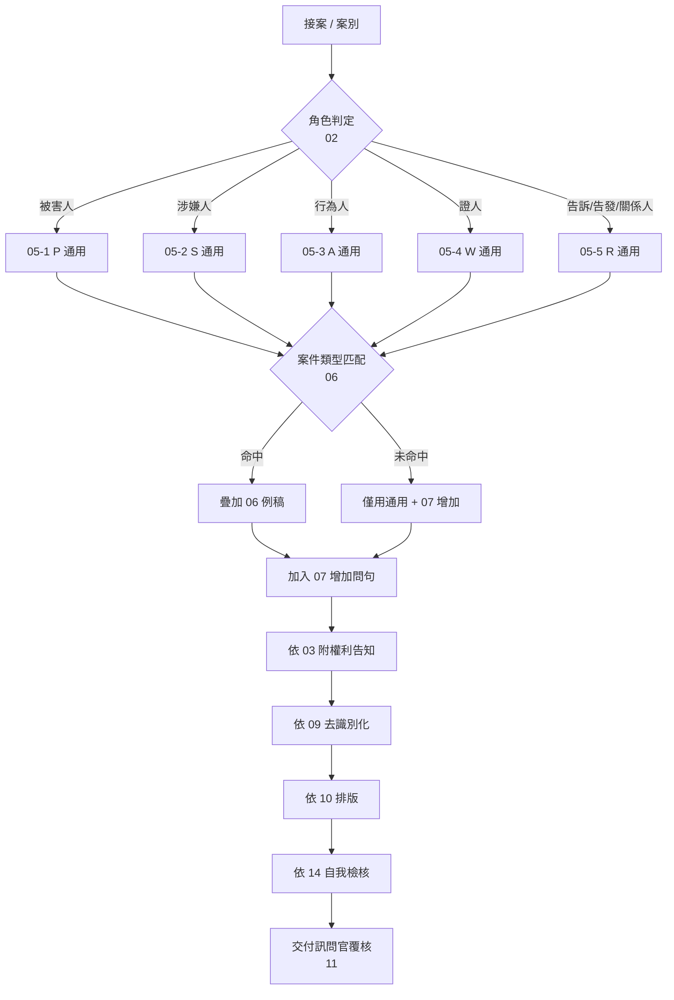

版本：1.0
日期：2026-10-07
作者：AI 初稿（待人工覆核）
變更紀錄：
- 1.0 (2026-10-07) 首版建立目錄骨架。

# 00 總目錄與使用說明

本檔案只負責：專案總覽、檔案目錄、使用流程、適用範圍、AI 能力邊界。**不寫問句**。

---

## 一、專案目的

為警詢人員提供「問句＋答留空」的**草稿產出**能力，輔助（非取代）警詢筆錄撰寫。
AI 產出的是**問句骨架**，不是**完整筆錄**；問與答之間由訊問官與被訊問人實地互動，AI 不得填答、不得潤飾答句、不得判斷案件事實。

## 二、檔案目錄

| 編號 | 檔案 | 職責 |
|---|---|---|
| 00 | 00_總目錄與使用說明.md | 目錄、使用流程、適用範圍、能力邊界 |
| 01 | 01_核心原則.md | 不可變動、可以增加、對象區分三項鐵則 |
| 02 | 02_角色與案件類型判定.md | 角色定義、判定流程、多角色處理 |
| 03 | 03_程序合法性與權利告知.md | 權利告知、程序檢核、特別程序 |
| 04 | 04_構成要件對應表.md | 法條、要件、對應問句編號 |
| 05 | 05_通用問句庫/ | 五類角色通用問句（見下） |
| 06 | 06_各案件類型例稿/ | 十類案件的原生問句 |
| 07 | 07_增加問句要素庫.md | 人、事、時、地、物、主觀、客觀、動機、意圖 |
| 08 | 08_證據清單與問句連結.md | 證據→問句→要件 三向連結 |
| 09 | 09_去識別化與敏感案件.md | 代號規則、對照表、敏感案件處理 |
| 10 | 10_筆錄格式與錄音錄影.md | 簽名、捺印、騎縫、附件、譯文、錄音錄影 |
| 11 | 11_人工覆核與版本控制.md | 覆核 SOP、錯誤處理、版本控制 |
| 12 | 12_AI執行指令.md | AI 執行步驟、禁止事項、允許事項 |
| 13 | 13_產出格式.md | 輸出模板 |
| 14 | 14_品質檢核表.md | 檢核表、自我檢核指令 |
| 15 | 15_待補項目與已知限制.md | 已知缺口、未完成事項 |
| 99 | 99_附錄/ | 錯字對照表、法條索引、姓名對照表格式 |

### 05 通用問句庫明細

| 檔案 | 角色代號 | 對像 |
|---|---|---|
| 05-1 | P (Victim) | 被害人 |
| 05-2 | S (Suspect) | 涉嫌人 |
| 05-3 | A (Actor) | 行為人 |
| 05-4 | W (Witness) | 證人 |
| 05-5 | R (Relator) | 告訴人/告發人/關係人 |

### 06 各案件類型例稿明細

| 編號 | 案件類型 | 首版狀態 |
|---|---|---|
| 06-1 | 性影像嫌疑人 | 已確認 |
| 06-2 | 性影像被害人 | 已確認 |
| 06-3 | 性騷擾行為人 | 已確認 |
| 06-4 | 性騷擾被害人 | 已確認 |
| 06-5 | 跟蹤騷擾被害人 | 已確認 |
| 06-6 | 違反保護令被害人 | 已確認 |
| 06-7 | 竊盜嫌疑人 | 待補 |
| 06-8 | 酒駕嫌疑人 | 待補 |
| 06-9 | 詐欺嫌疑人 | 待補 |
| 06-10 | 毒品嫌疑人 | 待補 |

## 三、使用流程



## 四、適用範圍

**適用**：
- 警詢階段之訊問、詢問、詢問被害人之問句規劃。
- 案件類型以 06 已列十類為第一版邊界；未列類型走 05 通用 + 07 增加。
- 問句層級的輔助產出（問句＋答留空）。

**不適用**：
- 偵查報告、訊問筆錄定稿、檢察官訊問、法官訊問。
- 答句撰寫、答句潤飾、答句翻譯（僅格式骨架可參考）。
- 法律意見、證詞判斷、證據能力判斷。
- 非警詢階段文件（民事調解、行政調查等）。

## 五、AI 能力邊界

### 允許事項
1. 依 12 之步驟產出「問句＋答留空」骨架。
2. 引用 05、06、07 之既有問句（**引用**，不新創）。
3. 依 04 之要件對照表提示**缺失要件**，並指向已有問句編號。
4. 依 09 替換姓名为代號；依 10 套用筆錄骨架格式。
5. 依 14 自我檢核並列出待補項目。

### 禁止事項
1. 不得新增未經人核的問句（12 有明列例外，但需標 `[NEW-CANDIDATE]`）。
2. 不得填答、預填答句、潤飾答句。
3. 不得判斷行為是否成立犯罪、是否可罰。
4. 不得省略或改寫權利告知（03）原文。
5. 不得跨檔案複製問句；引用一律走「見 XX-XX 第 N 題」。
6. 不得對敏感案件（09）做實體識別輸出。
7. 不得在無 03 程序合法性檢核通過前，輸出訊問段問句。

## 六、快速索引

- 想寫訊問/詢問流程 → 12
- 想輸出為 Word 樣式 → 13
- 想知道 AI 做完該交誰檢查 → 14、11
- 想加問句 → 07（不是自己造一句）
- 遇到敏感案件 → 09
- 想改檔案 → 11（版本控制）

## 七、版本規則

每個檔案開頭格式：

```text
版本：X.Y
日期：YYYY-MM-DD
作者：
變更紀錄：
- X.Y (YYYY-MM-DD) 摘要
```

- **Y** 位為問句內容新增或修正；
- **X** 位為架構調整、目錄增減、職責變更。
- 變更紀錄**只追加、不刪除**，保留完整歷史。
