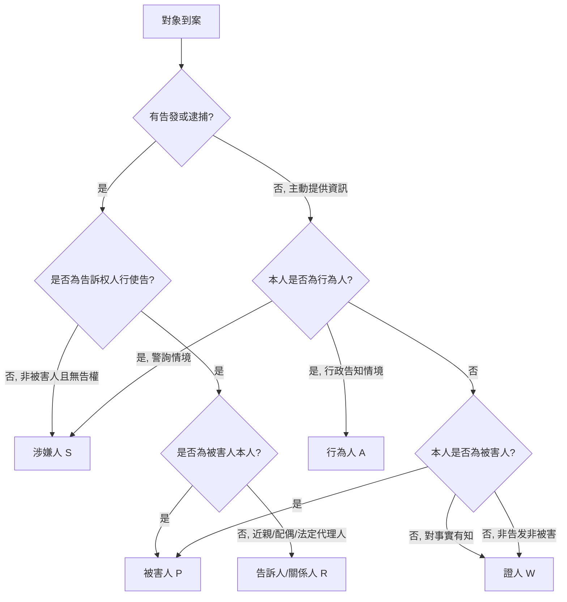

版本：1.0
日期：2026-10-07
作者：AI 初稿（待人工覆核）
變更紀錄：
- 1.0 (2026-10-07) 首版。

# 02 角色與案件類型判定

本檔案只負責：角色定義、判定流程、多角色併同處理、案件類型判定。**不寫問句**。

---

## 一、角色定義（五類）

### 1.1 被害人（Victim，代號 P）

**定義**：因犯罪行為而直接遭受法益侵害之人。

**訊問語言**：詢問式（見 01 附三條不可變動語氣第 2 項）。
**對應檔案**：05-1。
**關鍵特徵**：
- 身體、人格、財產法益受侵害；
- 對行為具有**親歷性**（目睹、體驗、感知）；
- 通常具告訴權或被害陳述權。

### 1.2 涉嫌人（Suspect，代號 S）

**定義**：有合理理由懷疑涉及犯罪、尚未被起訴或裁判確定之人；含警詢階段已拘提、逮捕或到案者。

**訊問語言**：訊問式（見 01 附三條不可變動語氣第 1 項）。
**對應檔案**：05-2。
**關鍵特徵**：
- 具刑事被告之風險；
- **訊問前必經權利告知**（見 03）；
- 全程得委任辯護人陪同（若適用特別程序，見 03）。

### 1.3 行為人（Actor，代號 A）

**定義**：實際執行構成要件行為之人；行為人常同時為涉嫌人，但在**民事告知、行政調查、警詢以外之告知情境**中，可能僅為行為人而非涉嫌人。

**訊問語言**：視情境而定；警詢階段依訊問式，行政告知依告知式。
**對應檔案**：05-3。
**關鍵特徵**：
- 行為本身已發生；
- 未必被追訴（例如行政處理、民事調解）。

### 1.4 證人（Witness，代號 W）

**定義**：非當事人，對事實有知並具告知義務者。

**訊問語言**：詢問式（見 01 附三條不可變動語氣第 2 項）。
**對應檔案**：05-4。
**關鍵特徵**：
- 與案件事實**知悉而非親歷全部**；
- 具證人告知義務（刑法第 169、170 條）；
- 不得訊問。

### 1.5 告訴人/告發人/關係人（Relator，代號 R）

**定義**：
- **告訴人**：告訴权人（被害人之親屬、配偶等；刑法第 234 條）。
- **告發人**：非告訴权人而為告訴之事實提出者（刑法第 244 條）。
- **關係人**：與被害人、涉嫌人有密切關係但未構成告訴权人者。

**訊問語言**：告知式。
**對應檔案**：05-5。
**關鍵特徵**：
- 具身份識別需求（誰告訴、告發、關係人身份）；
- 對事實**未必親歷**，得為轉述。

---

## 二、角色判定流程



**多角並存時**，一次訊問只採**一個主角色**；其他角色於獨立筆錄中另行處理。

## 三、多角色併同處理

### 3.1 同一筆錄不得混角

訊問人若同時以「被害人」與「證人」身分質問同一人，屬**角色混淆**，AI 偵測到此情形應中止產出並提示。

### 3.2 一個案件常有複數人

| 角色代號 | 常並存於 |
|---|---|
| P + S | 絕大多數刑事案件（被害人 vs. 涉嫌人） |
| P + R | 被害人不具告權或不在場（告訴人代位） |
| S + W | 涉嫌人供述與證人證言對比 |
| A + P | 民事告知（行為人 vs. 被害人） |

### 3.3 角色切換點

訊問中若發現對象**身分不符**（例：以「證人」身分進入，經詢問後發現自己是告訴人），訊問官應終止本筆錄、宣告新角色、另啟筆錄；AI 產出的問句**不得跨筆錄沿用**，需重新依新角色產生。

---

## 四、案件類型判定

### 4.1 判定原則

1. **依行為類型**（非結果）判定；
2. **依首發法條**（法條競合取一）判定；
3. **不確定時**取「最嚴格程序」案件類型（例：性影像 vs. 竊盜 → 取性影像）。

### 4.2 十類邊界速查

| 代號 | 案件類型 | 主要法條方向（細節見 04） |
|---|---|---|
| SX | 性影像 | 性交易防制法、兒童及少年性交易防制條例、刑法妨害性自主章 |
| SXH | 性騷擾 | 性騷擾防治法 |
| GS | 跟蹤騷擾 | 刑法第 311 條之 1 |
| BH | 違反保護令 | 家庭暴力防治法、保護令事件處理法 |
| QT | 竊盜 | 刑法第 320-322 條 |
| JD | 酒駕 | 道交法第 35、36 條 |
| ZH | 詐欺 | 刑法第 339、341 條 |
| DP | 毒品 | 毒品危害防制條例 |

### 4.3 未列類型

未列入十類者，走「05 通用 + 07 增加」，不新設案件類型檔案；如後續需要，由 15_待補項目 登記。

### 4.4 併案處理

同一事實涉多類案件（例：性影像 + 詐欺），訊問時取**首發或最嚴程序**為主軸，另一軸以「附加問句」處理並標記 `[CROSS:案件代號]`。

---

## 五、判定輸出

AI 每次產出前，必須在輸出最上方標明：

```text
[角色]：P
[案件類型]：SX
[角色檔案]：05-1
[例稿檔案]：06-2
```

若 `[案件類型]` 為「未列」或 `[角色檔案]` 缺失，AI 應中止並提示「需人工指定」。
